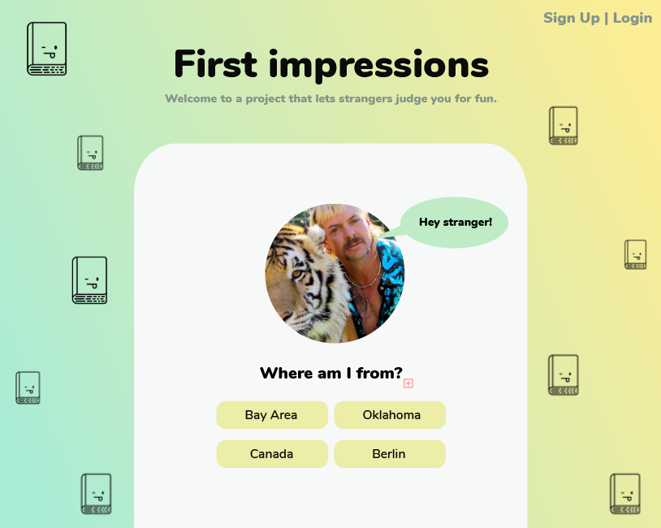
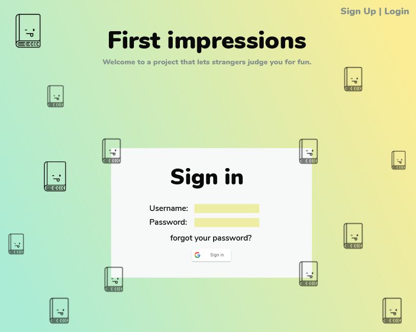
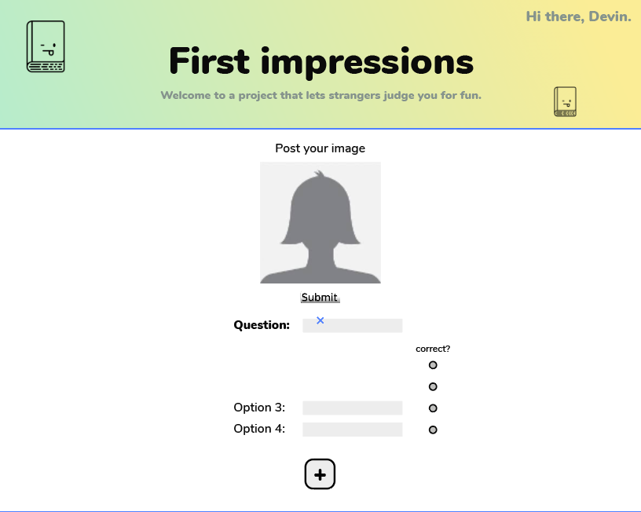

# First Impressions / Judge me

## Overview

We all know the saying "don't judge a book by it's cover." First impressions are typically wrong and based on stereotypical profiling. But what if... someone explicitly requested you to judge them by an image?

First Impressions is a web-based game that presents users with a photo of a stranger and a quiz about them with general attributes like name, city, job title, and more contentious attributes like race, sexual orientation, dietary restrictions, etc. How much can we truly uncover from an image of a person? How much falls through the cracks? First Impressions is fun for both those guessing about others as well as for those who upload a photo - what do people judge about your cover?

## Data Model

The application will store Profiles (user-uploaded), Users and Questions

* users can have one profile (via references)
* each profile can have multiple questions (by embedding)

An Example User:

```javascript
{
  email: "devinlewtan@gmail.com",
  password: "$ecret$auce",
  profile: // a reference to a Profile object
}
```

An Example Profile with Embedded Questions:

```javascript
{
  email: // a reference to a User object
  image: 'images/girl.jpg',
  questions: [
    {
    label: "what is my name?",
    options: [
      { value: "Devin", checked: true }, 
      { value: "Olivia", checked: false }, 
      { value: "Mackenzie", checked: false }, 
      { value: "Jessica", checked: false },
      ]
   ,
}
```

## [Link to Commented First Draft Schema](https://github.com/nyu-csci-ua-0480-008-spring-2020/devinlewtan-final-project/blob/6b9c07d862e3c4e1b2b903ec97d8684cc32678c6/db.js#L4)

## Wireframes

/ - page for showing all profiles (one at a time)



/signup - page for registering new user (same wireframe as login right now)



/login - page for user login 


/profile/create - page for creating a new profile 



/profile/results - page for showing how your profile is being judged


## [Site map](https://www.gloomaps.com/6H69np2mjP)

## User Stories or Use Cases

###### (non-registered)
1. as a user, I can pick one answer for each profile (quiz/poll style)
2. as a user, I can see the right answers once i've played 

###### (registered)
1. as a user, I can register an account on the site
2. as a user, I can log in to the site
3. as a user, I can upload a profile with the site
4. as a user, I can see what others guessed
5. as a user, I can share this with my friends (social media)

## Research Topics

* (4 points) Integrate [Google user sign in](https://developers.google.com/identity/sign-in/web/sign-in)
    * I'm going to be using Google for user authentication
    * I want login to be as frictionless as possible to encourage more users to create profiles 
* (5 points) Implement quiz functionality / html
    * see <code>https://github.com/jamesqquick/Build-A-Quiz-App-With-HTML-CSS-and-JavaScript</code>
    * I've never had to build something that has multiple answers with right/wrong statuses. It should be a good challenge for this assignment!
* (4 points) React.js
    * use react.js as the frontend framework. I am looking forward to learning react because I feel it is a transferrable skill from school to full time engineering gigs.
* maybe look into TypeScript? (seems like a more secure form of Javascript regarding type errors)

## [Link to Initial Main Project File](https://github.com/nyu-csci-ua-0480-008-spring-2020/devinlewtan-final-project/blob/d7a93d52d3a7f440ab183288925033ad5d89984d/app.js#L1)

## Annotations / References Used

1. [Google user sign in](https://developers.google.com/identity/sign-in/web/sign-in) - (add link to source code that was based on this)
2. [tutorial on quiz functionality / html](https://github.com/jamesqquick/Build-A-Quiz-App-With-HTML-CSS-and-JavaScript) - (add link to source code that was based on this)
